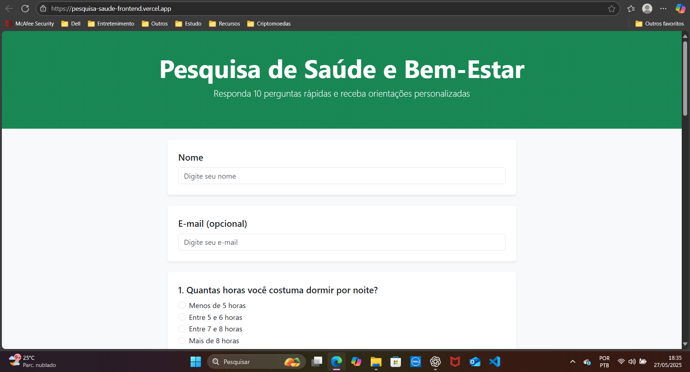

# Backend da Pesquisa de Saúde e Bem-Estar

Este é o backend do Projeto desenvolvido para a **Atividade de Extensão Universitária** do curso de Análise e Desenvolvimento de Sistemas, visando a coleta de dados sobre saúde e bem-estar, com retorno de orientações personalizadas geradas por Inteligência Artificial.



## 📝 Descrição

Este backend foi desenvolvido utilizando FastAPI e integra a API da OpenAI para gerar respostas personalizadas com base nas informações fornecidas pelos participantes no formulário. O sistema recebe os dados enviados pelo frontend, processa as respostas, solicita uma análise à IA e retorna dicas personalizadas para a melhoria da saúde e bem-estar do usuário.

Além disso, o backend também implementa validações básicas de entrada, formatação dos dados e envio opcional das respostas personalizadas por e-mail.

## 🚀 Tecnologias utilizadas

- Python
- FastAPI
- OpenAI API
- SMTP (para envio de e-mails)

## 🌐 Acesso online

O sistema está publicado e pode ser acessado através do link abaixo:

🔗 [https://pesquisa-saude-frontend.vercel.app/](https://pesquisa-saude-frontend.vercel.app/)

## 💻 Como rodar localmente

Este backend foi desenvolvido para funcionar em conjunto com o frontend do projeto. O fluxo completo se dá da seguinte forma:

- O usuário acessa a interface web (frontend) e preenche o questionário.
- O frontend envia os dados coletados para o backend via requisição HTTP.
- O backend processa os dados, consulta a API da OpenAI e devolve a resposta personalizada ao frontend.

⚠️ **Importante**: O backend sozinho não possui interface de usuário. O frontend é essencial para que o sistema funcione corretamente.

## ✅ Pré-requisitos

- Python 3.10+
- Pip (gerenciador de pacotes Python)
- Conta na OpenAI com chave de API válida
- Variáveis de ambiente configuradas:
  - `OPENAI_API_KEY`
  - `EMAIL_SENDER`
  - `EMAIL_PASSWORD`
  - `EMAIL_RECEIVER`
- Node.js e npm (para rodar o frontend)

## ✅ Passos para rodar o projeto completo

### 1. Clone o repositório (contendo as pastas frontend e backend):

```bash
git clone https://github.com/SEU_USUARIO/pesquisa-saude.git
cd pesquisa-saude
```

### 2. Configure o Backend

```bash
cd backend
python -m venv venv
source venv/bin/activate  # No Windows: venv\Scripts\activate
pip install -r requirements.txt
```

✅ Crie um arquivo `.env` com as variáveis de ambiente:

```ini
OPENAI_API_KEY=sk-xxxxxxxx
EMAIL_SENDER=seu_email@gmail.com
EMAIL_PASSWORD=sua_senha
EMAIL_RECEIVER=destinatario@gmail.com
```

### 3. Inicie o Backend

```bash
uvicorn main:app --reload
```

O backend será iniciado em:  
http://127.0.0.1:8000

### 4. Configure e inicie o Frontend

```bash
cd ../frontend
# Caso use um gerenciador de pacotes como npm:
npm install
npm run dev
```

Ou simplesmente abra o arquivo `index.html` em seu navegador, se for um frontend estático puro.

## ✅ Teste o Sistema

- Acesse o frontend.
- Preencha o formulário.
- O frontend enviará os dados para o backend, que responderá com a análise gerada pela OpenAI.

## ✅ Observação

Em produção, recomenda-se o deploy do frontend (por exemplo, no Vercel) e do backend (por exemplo, no Render), garantindo que ambos fiquem acessíveis na internet. Não se esqueça de configurar os CORS no backend para permitir conexões com o frontend.

3. Abra o arquivo `index.html` diretamente no seu navegador ou utilize uma extensão como **Live Server** no VSCode para melhor experiência.

## 👤 Autor

Desenvolvido por **Luiz Ricardo Dererita de Araújo**.

## ⚠️ Licença

Este projeto é destinado exclusivamente para fins acadêmicos e de pesquisa universitária. **Não é autorizada a reprodução, distribuição ou comercialização parcial ou total** sem a devida autorização do autor.
